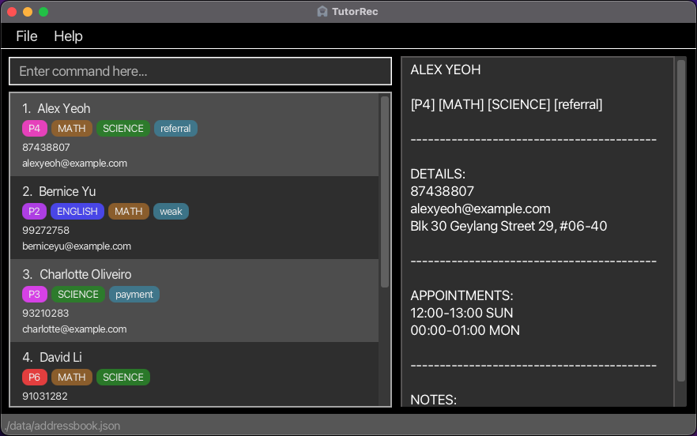
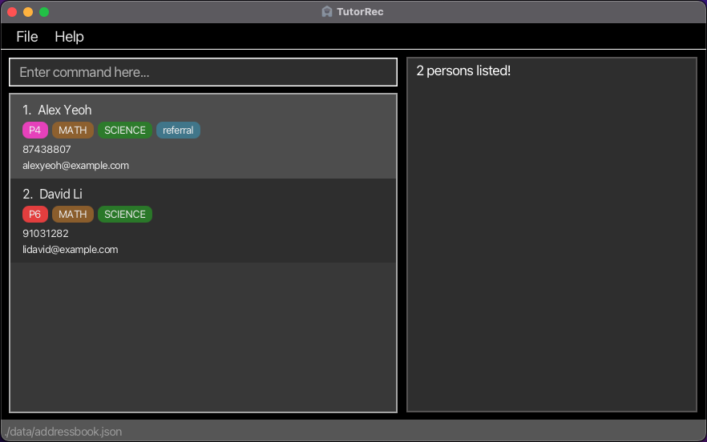

TutorRec is a **desktop app for 1-to-1 home tutors to manage student contacts, optimized for use via a Command Line Interface** (CLI) while still having the benefits of a Graphical User Interface (GUI). If you can type fast, TutorRec can get your contact management tasks done faster than traditional GUI apps.

* Table of Contents
{:toc}

--------------------------------------------------------------------------------------------------------------------

## Quick start

1. Ensure you have Java `11` or above installed in your Computer.

1. Download the latest `tutorrec.jar` from [here](https://github.com/AY2324S2-CS2103-F09-3/tp/releases).

1. Copy the file to the folder you want to use as the _home folder_ for TutorRec.

1. Open a command terminal, `cd` into the folder you put the jar file in, and use the `java -jar tutorrec.jar` command to run the application. 
   A GUI similar to the one below should appear in a few seconds. Note how the app contains some sample data. 
   

1. Type a command in the command box and press Enter to execute it. e.g. typing **`help`** and pressing Enter will open the help window. 
   Some example commands you can try:

   * `list` : Lists all contacts.

   * `add n/Jun Jie p/98765432 e/jj@example.com a/Clementi Ave 3, block 442, #06-01 nt/Weak at Maths t/referral ap/10:00-12:00 SAT s/MATH l/P1` : Adds a contact named `Jun Jie` to the address book.

   * `delete 3` : Deletes the 3rd contact shown in the current list.

   * `clear` : Deletes all contacts.

   * `exit` : Exits the app.

1. Refer to the [Features](#features) below for details of each command.

--------------------------------------------------------------------------------------------------------------------

## Features

**:information_source: Notes about the command format:** 

* Words in `UPPER_CASE` are the parameters to be supplied by the user. 
  e.g. in `add n/NAME`, `NAME` is a parameter which can be used as `add n/Jun Jie`.

* Items in square brackets are optional. 
  e.g `n/NAME [t/TAG]` can be used as `n/Jun Jie t/` or as `n/Jun Jie`.

* Items with `…`​ after them can be used multiple times including zero times. 
  e.g. `[t/TAG]…​` can be used as ` ` (i.e. 0 times), `t/Raffles`, `t/Raffles t/ALevel` etc.

* Parameters can be in any order. 
  e.g. if the command specifies `n/NAME p/PHONE_NUMBER`, `p/PHONE_NUMBER n/NAME` is also acceptable.

* Extraneous parameters for commands that do not take in parameters (such as `help`, `list`, `exit` and `clear`) will be ignored. 
  e.g. if the command specifies `help 123`, it will be interpreted as `help`.

* Prefixes are adjusted to accept predefined convenient short forms, 
  e.g., `hp/`, `addr/`, `subj/`, `lvl/`.

    * You may choose to use short form or long form of prefixes, e.g., `n/` or `name/`, which are interchangeable.

    * Prefixes are also adjusted to accept some predefined slightly incorrect variations, in case of user typos. 
      The full list of accepted typos and short forms are listed below:
      * `n/`: `name/` `nae/` `nam/`
      * `p/`: `phone/` `phon/` `hp/` `handphone/`
      * `e/`: `email/` `emai/` `em/` `ema/`
      * `a/`: `address/` `addr/` `add/` `ad/` `addres/` `adress/`
      * `p/`: `phone/` `phon/` `hp/` `handphone/`
      * `nt/`: `note/` `not/` `nt/` 
      * `t/`: `tag/` `ta/` `tg/` 
      * `ap/`: `appointment/` `appt/` `appoint/` `appointmen/`
      * `s/`: `subject/` `subj/` `sub/` `subjec/` `subje/`
      * `l/`: `level/` `lvl/` `leve/` `lv/` `lev/` `lvel/` `evel/`

* TutorRec is currently **not** resizable

* If you are using a PDF version of this document, be careful when copying and pasting commands that span multiple lines as space characters surrounding line-breaks may be omitted when copied over to the application.

### Formatting fields for a person

A person has the following fields: `Name`, `Phone`, `Email`, `Address`, `Note`, `Tag`, `Appointment`,
`Subject` and `Level`.

Below lists the requirements for each to be a valid field.

- `Name`: Must be alphanumeric.
  - `Jane`, `Jane1` are valid
  - `Jane@`, `**&&&` are not valid.
- `Phone`: Must only contain numbers
  - `999`, `12341234` are valid.
  - `123Phone`, `aeiou` are not valid.
- `Email`: Contains two parts, in the format `local-part@domain`
  - `local-part` must adhere to the following restrictions:
    - Contain only alphanumeric characters
    - May contain the following special characters `+_.-`
    - May not begin with the above mentioned special characters
  - `domain` must adhere to the following restrictions:
      - contain only letters, numbers, and dashes (`-`), note that hyphens **cannot** be the first or last characters of the domain
      - the final part of the domain:
          - is defined by a `.` to separate it from other parts of the domain
          - is defined by the entire domain if no `.` is present
          - must be at least two characters long
      - ergo, the following are examples of domains which are valid and invalid:
          - `cc`, `test.com`, `name-separator.gov` are valid
          - `a`, `t*.ab`, `invalid.sep-` are not valid
  - With these restrictions in mind, the following are some valid and invalid emails:
    - `alex@example.com`, `jorge@website.site.com`, `jack_jane.john@example.com` are valid.
    - `alex@@example.com`, `jorge@website.site.com-`, `jack&jane*john@example.com` are not valid.
- `Address`: Must not be blank or contain only spaces.
  - Note that entering an address which is blank or has spaces will instead treat a person as having no address. Valid addresses are still only those which do not violate the above criteria.
- `Note`: Must not be blank or contain only spaces
  - See above.
- `Tag`: Should be alphanumeric: [a-zA-Z0-9]
- `Subject`: Must be `MATH`, `SCIENCE`, `ENGLISH` or `MT`.
- `Level`: Must be `P1`, `P2`, `P3`, `P4`, `P5` or `P6`.
- `Appointment`: Must be in the format `START_TIME-END_TIME DAY`
  - `START_TIME` and `END_TIME` are in the 24-hour format of `HH:MM`. The time of `START_TIME` must strictly be smaller than `END_TIME`
  - `DAY` must be one of the following: `MON`, `TUE`, `WED`, `THU`, `FRI`, `SAT`,`SUN`.
    - Respectively, these represent Monday, Tuesday, Wednesday, Thursday, Friday, Saturday, and Sunday.
    - These are not case-sensitive
  - `12:00-13:00 MON`, `16:59-22:00 sun` are valid.
  - `13:00-11:00 MON`, `16:0000-19:1234 MON`, `16:00-17:00 SUNDAY` are not valid.
  - Overlapping appointments between students are strictly not allowed as TutorRec is for tutors who provide 1-to-1 tutoring.

### Duplicate detection  for names and contacts

* TutorRec does not allow for duplicate contacts, and contacts are differentiated by their unique names.
  
    * Names are not case-sensitive, `John Doe` is the same name as `JOhn dOE`
  
    * Whitespaces do differentiate names apart, e.g., `Mary Anne` is a different name (and person) from `Maryanne`.

* TutorRec's duplicate detection system ignores case and extra whitespace when comparing names.

  * When adding or editing a contact, if a similar name is detected, regardless of case or whitespace differences, users 
    are warned about potential duplicates.

* In TutorRec, a contact’s phone number and email address do not need to be unique. This flexibility allows you to save the same contact details for parents who have multiple children enrolled with you. As such, it is acceptable for different contacts to share the same phone number and email address.

### Viewing help : `help`

Shows a message explaining how to access the help page.

Format: `help`

### Adding a person: `add`

Adds a person to the address book.

Format: `add n/NAME [p/PHONE_NUMBER] [e/EMAIL] [a/ADDRESS] [nt/NOTE] [ap/APPOINTMENT] [t/TAG] [s/SUBJECT] [l/LEVEL]…​`

:bulb: **Tip:**
A person can have any number of tags, and any number of appointments (including 0).

Examples:
* `add n/Jun Jie p/98765432 e/jj@example.com a/Clementi Ave 3, block 442, #06-01 s/MATH`
* `add n/Monica Chng e/mc@example.com a/Dempsey Hill p/81888818 ap/10:00-12:00 FRI l/P6`
* `add n/Abel nt/exstudent ap/12:00-15:00 SUN ap/18:00-22:00 TUE`

Only the "Name" field is mandatory. If you do not wish to have the other fields to have values, you can add the person
in without the corresponding prefix, or leaving the prefix blank.

For example:
* `add n/John`
* `add n/John a/`

Both create the same person in the address book (i.e. a person named "John" with no address).
The same logic applies to the other fields.

:warning: **Note:**
New appointments **must not overlap with each other** and should not overlap with existing appointments. 

### Listing all persons : `list`

Shows a list of all persons in the address book.

Format: `list`

### Viewing a person : `view`

Displays all information of a person on the side window.

Format: `view INDEX`

* Displays all information of the person at the specified index. The index refers to the index number shown in the displayed person list.
The index **must be a positive integer** 1, 2, 3, ...

### Editing a person : `edit`

Edits an existing person in the address book.

Format: `edit INDEX [n/NAME] [p/PHONE_NUMBER] [e/EMAIL] [a/ADDRESS] [nt/NOTE] [ap/APPOINTMENT] [t/TAG] [s/SUBJECT] [l/LEVEL]…​`

* Edits the person at the specified `INDEX`. The index refers to the index number shown in the displayed person list.
The index **must be a positive integer** 1, 2, 3, …​
* At least one of the optional fields must be provided.
* Existing values will be updated to the input values.
* When editing tags, the existing tags of the person will be removed i.e adding of tags is not cumulative.
* You can remove all the person’s tags by typing `t/` without
    specifying any tags after it. Appointments work similarly (i.e. typing `ap/` with no appointments after it clears all appointments)
* You can remove fields (except for name) by typing the prefix for the relevant field and leaving it blank.

Examples:
*  `edit 1 p/91234567 e/jj@example.com` Edits the phone number and email address of the 1st person to be `91234567` and `jj@example.com` respectively.
*  `edit 2 n/Monica Chng t/` Edits the name of the 2nd person to be `Monica Chng` and clears all existing tags.
*  `edit 3 n/Bobby Brown p/` Edits the name of the 3rd person to be `Bobby Brown` and removes the `phone` field.

### Locating persons by name : `find`

Finds persons whose names contain any of the given keywords.

Format: `find KEYWORD [MORE_KEYWORDS]`

* The search is case-insensitive. e.g `hans` will match `Hans`.
* The order of the keywords does not matter. e.g. `Hans Bo` will match `Bo Hans`.
* Only the name is searched.
* Only full words will be matched e.g. `Han` will not match `Hans`.
* Persons matching at least one keyword will be returned (i.e. `OR` search).
  e.g. `Hans Bo` will return `Hans Gruber`, `Bo Yang`.

Examples:
* `find Jun` returns `jun` and `Jun Jie`.
* `find alex david` returns `Alex Yeoh`, `David Li`. 
  

### Deleting a person : `delete`

Deletes the specified person from the address book.

Format: `delete INDEX`

* Deletes the person at the specified `INDEX`.
* The index refers to the index number shown in the displayed person list.
* The index **must be a positive integer** 1, 2, 3, …​

Examples:
* `list` followed by `delete 2` deletes the 2nd person in the address book.
* `find Monica` followed by `delete 1` deletes the 1st person in the results of the `find` command.

### Viewing all appointments : `appointments`

Displays all appointments of persons currently displayed in the list, sorted, along with the persons involved. 
Optionally, you may specify a `DAY` or multiple `DAY`s to further restrict the appointments displayed.

Format: `appointments [DAY]`

* `DAY` must be one of `MON`, `TUE`, ..., `SUN`.
* `[DAY]` may be empty.

Examples:
* `appointments` returns all appointments among the displayed persons.
* `appointments MON` returns all appointments among the displayed persons on Monday.
* `appointments MON TUE` returns all appointments among the displayed persons on Monday and Tuesday.

### Clearing all entries : `clear`

Clears all entries from the address book.

Format: `clear`

### Exiting the program : `exit`

Exits the program.

Format: `exit`

### Saving the data

TutorRec data is saved in the hard disk automatically after any command that changes the data. There is no need to save manually.

### Editing the data file

TutorRec data is saved automatically as a JSON file `[JAR file location]/data/addressbook.json`. Advanced users are welcome to update data directly by editing that data file.

:exclamation: **Caution:**
If your changes to the data file makes its format invalid, TutorRec will discard all data and start with an empty data file at the next run. Hence, it is recommended to take a backup of the file before editing it. 
Furthermore, certain edits can cause TutorRec to behave in unexpected ways (e.g., if a value entered is outside of the acceptable range). Therefore, edit the data file only if you are confident that you can update it correctly.

### Archiving data files `[coming in v2.0]`

_Details coming soon ..._

--------------------------------------------------------------------------------------------------------------------

## FAQ

**Q**: How do I transfer my data to another Computer? 
**A**: Install the app in the other computer and overwrite the data file it creates with the file that contains the data in your previous TutorRec home folder.

--------------------------------------------------------------------------------------------------------------------

## Known issues

1. **When using multiple screens**, if you move the application to a secondary screen, and later switch to using only the primary screen, the GUI will open off-screen. The remedy is to delete the `preferences.json` file created by the application before running the application again.

--------------------------------------------------------------------------------------------------------------------

## Command summary

Action | Format, Examples
--------|------------------
**Add** | `add n/NAME [p/PHONE_NUMBER] [e/EMAIL] [a/ADDRESS] [nt/NOTE] [ap/APPOINTMENT] [t/TAG] [s/SUBJECT] [l/LEVEL]…​`   e.g., `add n/Jun Jie p/98765432 e/jj@example.com a/Clementi Ave 3, block 442, #06-01 s/MATH`
**View appointments** | `appointments [DAY]`
**Clear** | `clear`
**Delete** | `delete INDEX`  e.g., `delete 3`
**Edit** | `edit INDEX [n/NAME] [p/PHONE_NUMBER] [e/EMAIL] [a/ADDRESS] [nt/NOTE] [ap/APPOINTMENT] [t/TAG] [s/SUBJECT] [l/LEVEL]…​`  e.g.,`edit 2 n/James Lee e/jameslee@example.com`
**Find** | `find KEYWORD [MORE_KEYWORDS]`  e.g., `find James Jake`
**List** | `list`
**View person details** | `view INDEX`
**Help** | `help`
**Exit** | `exit`
